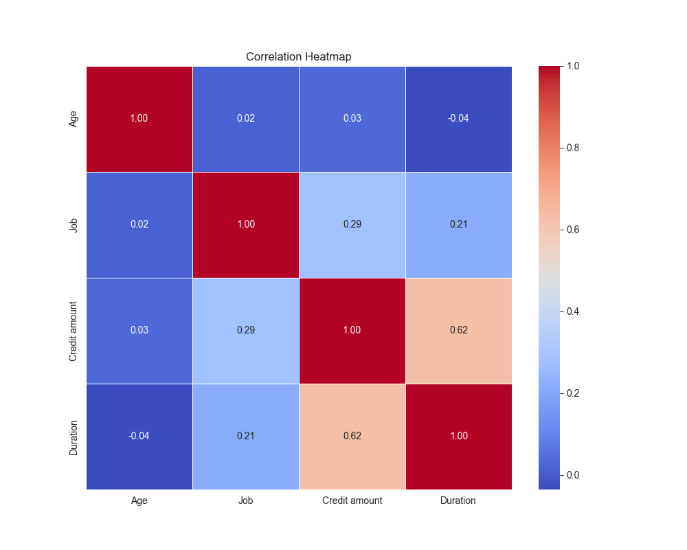
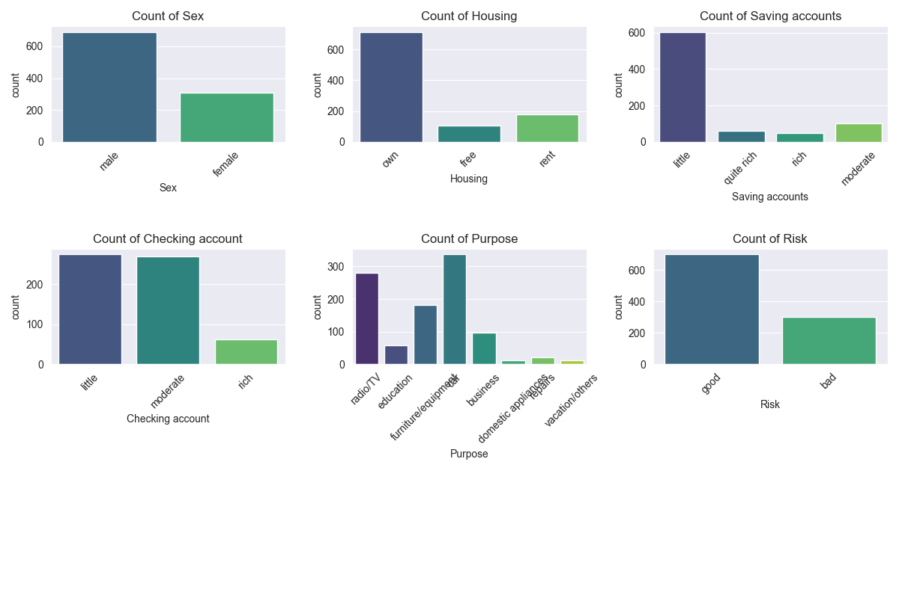
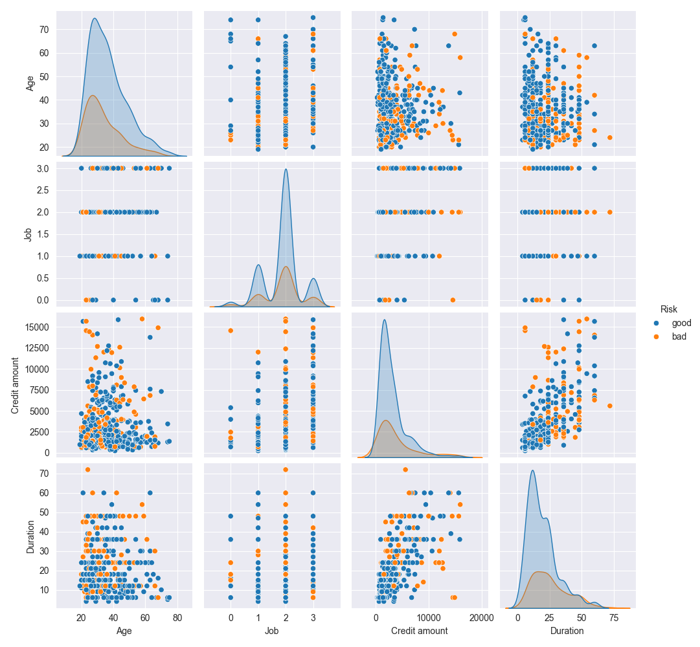
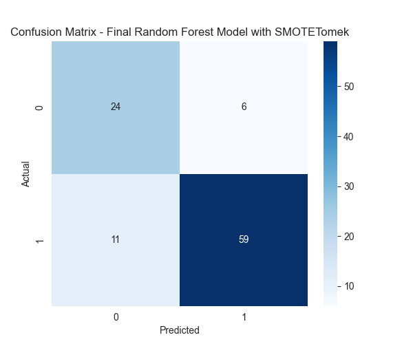

# Credit Risk Classification with Random Forest

## 📌 Project Overview
This project focuses on predicting credit risk using machine learning techniques. The dataset contains information about customers and their financial background, and the goal is to classify them into low-risk (good credit) or high-risk (bad credit) categories.

The model is trained using **Random Forest**, with **SMOTETomek** applied to balance the dataset and improve classification performance.

## ⚙️ Installation & Setup

1. Clone the Repository:
   ```bash
   git clone https://github.com/ozanguneyli/Credit-Risk-Classification.git
   cd Credit-Risk-Classification
   ```
2. Create a Virtual  Environment (Optional but recommended):
   ```bash
    python -m venv venv
    source venv/bin/activate # On Windows: venv\Scripts\activate
   ```
3. Install Dependencies
   ```bash
    pip install -r requirements.txt
   ```

## 🚀 Technologies Used
- Python
- Pandas, NumPy
- Scikit-learn
- Matplotlib, Seaborn
- Imbalanced-Learn (SMOTETomek)

## 📊 Dataset
The dataset used in this project is the `German Credit Dataset`, which contains various financial attributes of customers, including:
-  `Age`
-  `Sex`
-  `Credit Amount`
-  `Housing Status`
-  `Account Balance`
-  `Loan Purpose`
-  `Risk (Target Variable: good or bad)`

## 📂 Project Structure
│── dataset/                     # Raw and processed datasets  
│── models/                      # Trained models and scalers  
│── images/                      # Plots and visualizations  
│── main.py                      # Main script to run the project  
│── model.py                     # Model training and evaluation  
│── data_loader.py               # Loads the dataset  
│── data_preprocessing.py        # Data cleaning and preprocessing  
│── data_exploration.py          # Visualization functions  
│── requirements.txt             # Required Python packages  
│── README.md                    # Project documentation  

## 1️⃣ Data Preprocesing

- Dropped unnecessary columns
- Handled missing values
- Encoded categorical variables using Label Encoding
- Normalized numerical features with StandardScaler
- Target variable (Risk) encoded as 0 (Bad) / 1 (Good)

## 2️⃣ Exploratory Data Analysis (EDA)






## 3️⃣ Handling Imbalanced Data

- Used SMOTETomek (Combination of SMOTE & Tomek Links) to oversample the minority class and remove noise.

# 🚀 How to Run the Project

   ```bash
    python main.py
   ```

# 📈 Results & Performance

| Class       | Precision | Recall | F1-Score | Support |
|------------|----------|--------|----------|---------|
| **0** (Bad Credit)  | 0.69 | 0.80 | 0.74 | 30 |
| **1** (Good Credit) | 0.91 | 0.84 | 0.87 | 70 |
| **Accuracy**  | - | - | **0.83** | **100** |
| **Macro Avg** | 0.80 | 0.82 | 0.81 | 100 |
| **Weighted Avg** | 0.84 | 0.83 | 0.83 | 100 |




## License

[MIT License](LICENSE)

📌 The trained model and scaler are saved in the models/ directory for future use.
